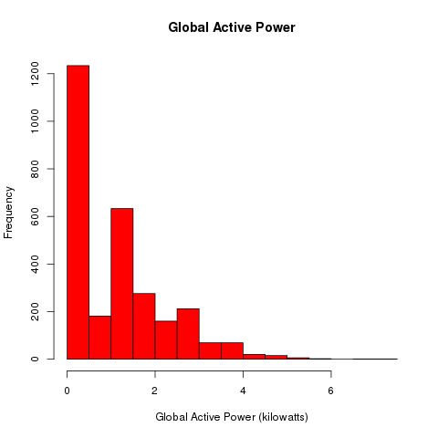
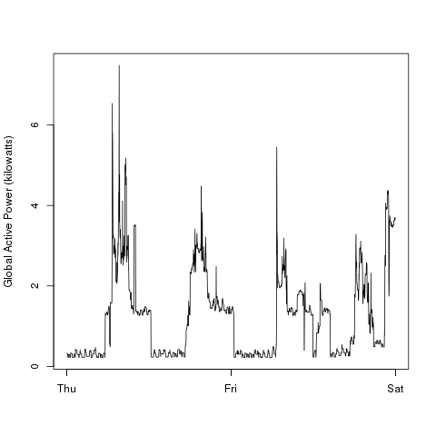
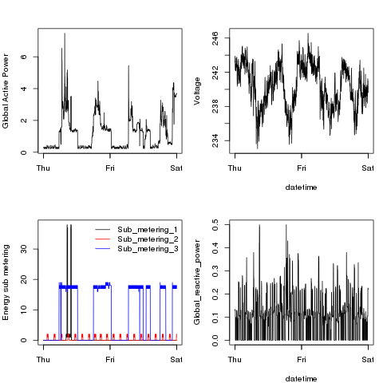

## Introduction

This is my submission for the first programming assignment of Exploratory Data Analysis.

### Contents

It consists of 5 R scripts
* load_household_power_consumption.R
* plot1.R
* plot2.R
* plot3.R
* plot4.R

Each of the plot scripts will source in the load_household_power_consumption.R and then construct
a png file as per the requirements of the assignment.

The load script needs to be in the current working directory to be found.
It will download the 20MB data file, if not already present,  and load the data set into working memory 
(this requires the ability to store ~100MB in RAM) then subset it down to the required two
days 1st Feb 2007 and 2nd Feb 2007.
It should not be necessary to run this script directly as it is sourced into each of the plot scripts.

In addition the original README file is a available as [README-orig.md](README-orig.md), containing the 
requirements of the assignment and the description of the data.

### Sample Results

The four plots that I have constructed are shown below

### Plot 1

### Plot 2

### Plot 3

### Plot 4

